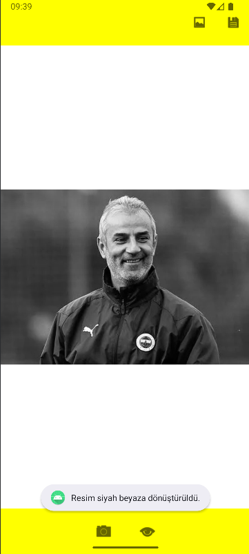
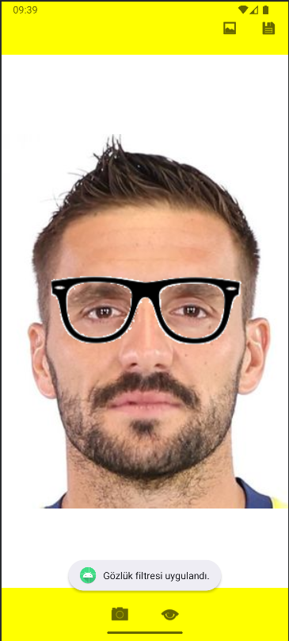

# FilterApp 🎨📱

FilterApp, Android cihazlar için geliştirilmiş bir **görsel filtreleme ve yüz algılama** uygulamasıdır. Kullanıcıların cihaz galerilerinden seçtikleri fotoğraflara gerçek zamanlı filtreler ve efektler uygulanabilir.

---
## 📸 Ekran Görüntüleri

|    Siyah Beyaz Filtresi    |    Gözlük Filtresi    |
| -------------------------------- | ------------------------------- |
|  |  |

---

## 🚀 Özellikler

- 📸 **Galeriden Fotoğraf Seçme:** Cihazdan kolayca görsel seçimi.
- 🎭 **Yüz Algılama:** OpenCV destekli yüz tespiti.
- 🕶️ **Gözlük & Aksesuar Ekleme:** Yüz üzerinde otomatik konumlanan aksesuar görselleri.
- 🎨 **Filtre Uygulama:** Görsellere çeşitli görsel efektler eklenebilir.
- 💾 **Kaydetme:** Düzenlenen fotoğrafları cihaz hafızasına kaydetme.

---

## 🛠️ Kullanılan Teknolojiler

- **Kotlin** : Uygulama dili.
- **OpenCV** : Görüntü işleme ve yüz algılama.
- **AndroidX** : Modern Android bileşenleri.
- **Activity Result API** : Galeriden resim seçimi için.

